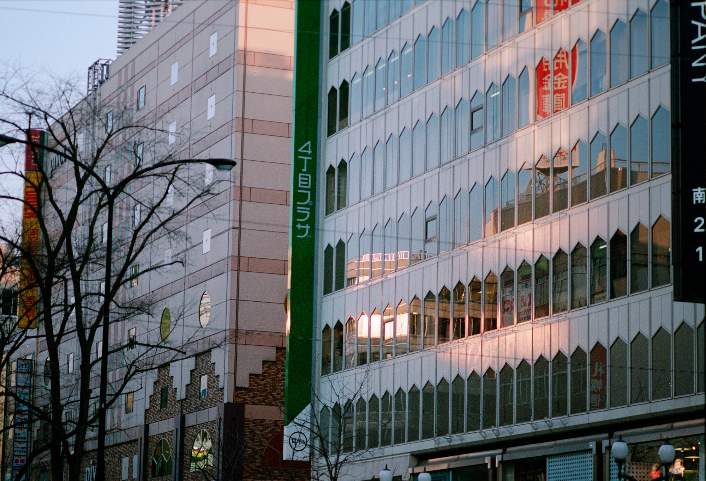

<div class="l-screen">
  

  <div class="intro">
  <br />
  
  
# / hɪˈbɪˈkiː /

##### n. resounding

<br />

## a research-first organisation
## using advances in machine learning
## to provide clarity in financial markets
## through world-class innovation
## from the heart of Cambridge Science Park
  
  <br />
  </div>
</div>

```{r leaflet, echo=FALSE, layout="l-screen"}

library(leaflet)
library(magrittr)

leaflet() %>%
  addTiles() %>%
  setView(lng = 0.14589, lat = 52.23385, zoom = 18)
```

